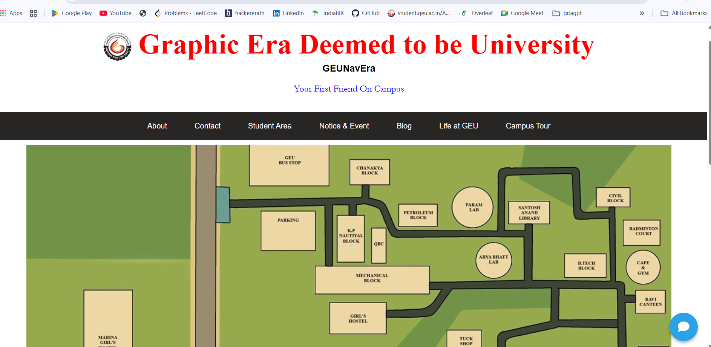
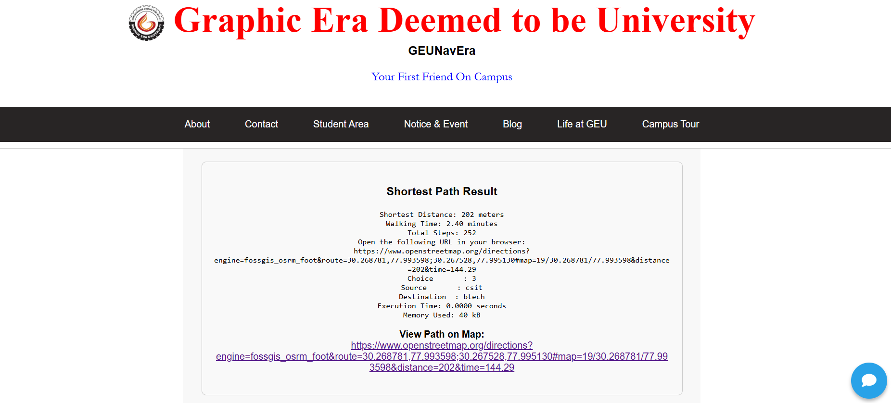
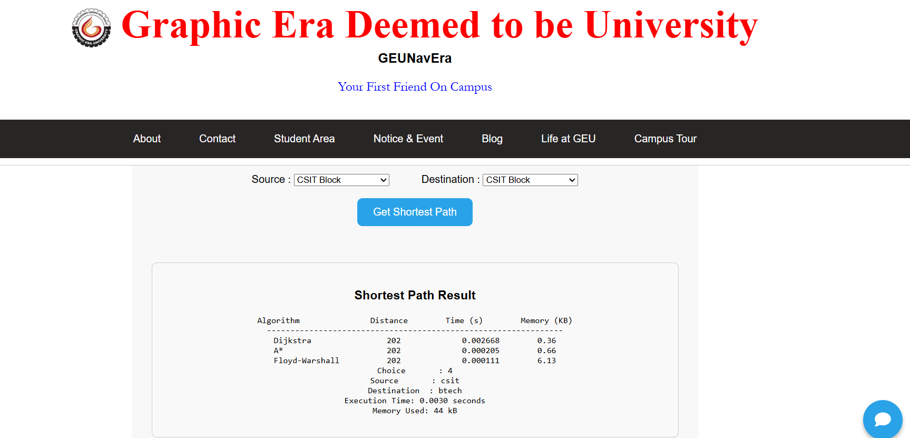
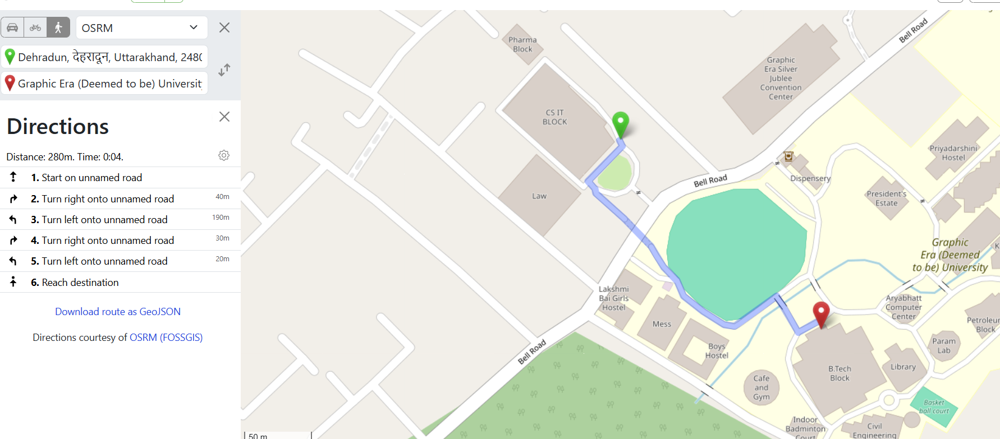
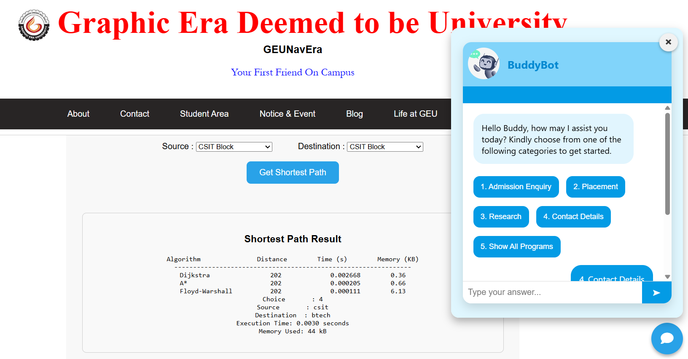

# GeuNavEra-Smart-Campus-Navigation-System
GeuNavEra is a flask based web application providing optimal campus route using Data Structures Algorithm( Dijkstra,  A*, Floyd - Warshall). It features real time map visualization with the help of OpenStreetMap and Vincenty-based distance accuracy, step/time estimation,
**Type:** Team Project  

-----

## 📋 Table of Contents
- [Project Overview](#project-overview)  
- [Features](#features)  
- [Technology Stack](#technology-stack)  
- [Data Structures & Algorithms](#data-structures--algorithms)  
- [Architecture & Workflow](#architecture--workflow)  
- [Installation & Setup](#installation--setup)  
- [Usage & Walkthrough](#usage--walkthrough)  
- [Team Responsibilities](#team-responsibilities)   

-----

## ✨ Features

🔐 **Login Page** : for secure access  
🗺️ **Clickable Static Campus Map** : showing building images on click  
🔽 **Dropdown Selection** : of source, destination, and algorithm  
🔁 **Graph Algorithms** : in C (Dijkstra, A*, Floyd-Warshall)  
🧭 **Vincenty Formula** : for real geodesic distance  
🧠 **Heuristic A\*** : for efficient route calculation  
🗨️ **Chatbot Assistant** : for help and suggestions  
📍 **Output** includes:
  - Distance (meters)  
  - Estimated Time  
  - Walkable Steps  
  - Visual Route on OpenStreetMap  

-----

## 🛠️ Technology Stack

| Layer            | Tools / Languages                |
|------------------|----------------------------------|
| Frontend         | HTML, CSS, JavaScript            |
| Backend          | Python (Flask)                   |
| Algorithms       | C (Dijkstra, A*, Floyd-Warshall) |
| Distance Metric  | Vincenty Formula (C/Python)      |
| Map              | Static Map (building selection)  |
| Chatbot          | Python                           |
| Styling          | Tailwind CSS                     |

-----

## 📚 Data Structures & Algorithms

- **Graphs** with nodes (blocks) and edges (paths)  
- **Dijkstra’s Algorithm** for shortest path  
- **A\*** for fast, heuristic-based route  
- **Floyd-Warshall** for all-pairs path  
- **Adjacency Matrix** for graph representation  
- **Vincenty** formula for accurate distance over the globe  

-----

## 🏗️ Architecture & Workflow

### 🔐 Login Page

### 🗺️ Main Map Page

### 📂 Output

### ⚙️ Comapare Algorithms

### 🧭 OSM Route Display

### 🤖 Chatbot Interface

-----

## ⚙️ Installation & Setup

- Open the project in IDE  
- Compile the algo.c file separately using Code::Blocks or a C compiler:
  gcc algo.c -o algo
- Install required Python dependencies
- Run the Flask application
  python app.py
- Open your browser and go to
  http://localhost:5000
-----

## 🎬 Usage & Walkthrough

- **Login Page** Enter your credentials to log in  
- **Main Page** Displays a static campus map with clickable blocks. Clicking a block shows related images 
- **Navigation Panel*** Select the algorithm (Dijkstra, Floyd Warshall, or A*), source, and destination using dropdownse  
- **Results Display** Shows total distance (using Vincenty formula), estimated time, and walkable steps.
- **Map Visualization** View the computed route using OpenStreetMap  
- **Chatbot Support** Interact with the assistant for help and navigation queries
  
-----

## 👥 Team Responsibilities

| Team Member      | Responsibilities                      |
|------------------|---------------------------------------|
| Member 1         |Implemented Dijkstra's Algorithm in C  |
|                  |integrated with Python Flask           |
|                  |Collected block images                 |
| Member 2         |Implemented Floyd Warshall Algorithm   |
|                  | designed the Login Page               |
|                  | Integrated Chatbot functionality      |
| Member 3         | Implemented A* Algorithm using a heuristic approach   |
|                  | Developed Map Page                    |
|                  | Handled Block Image Mapping           |
  
-----

